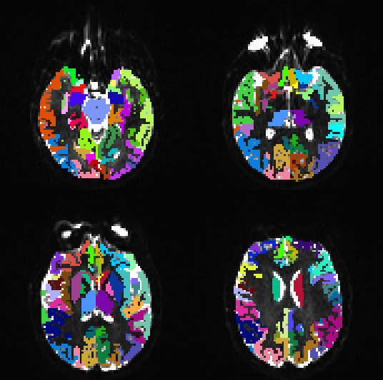
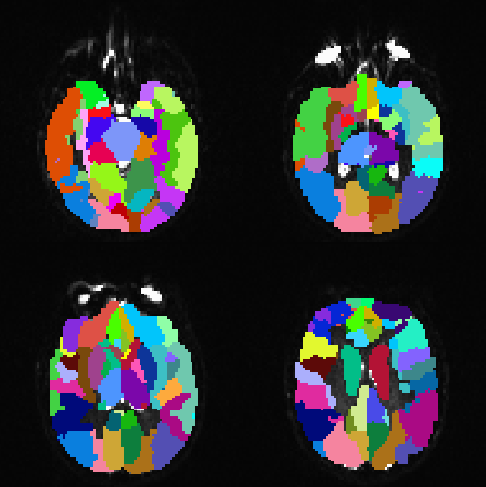
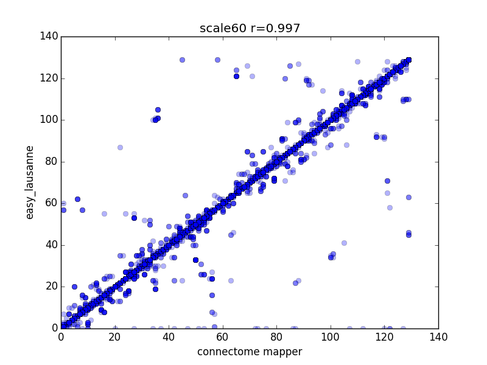
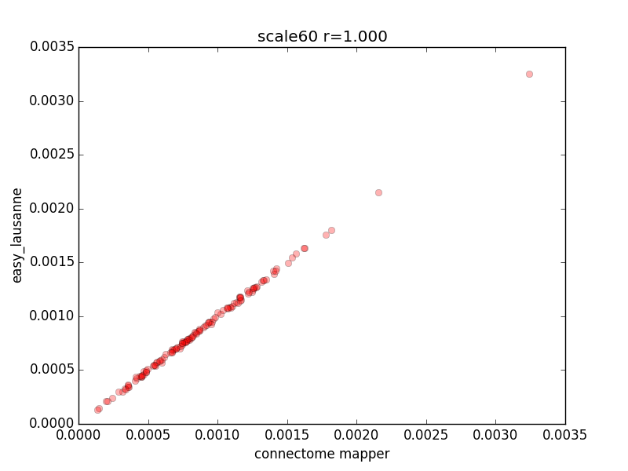
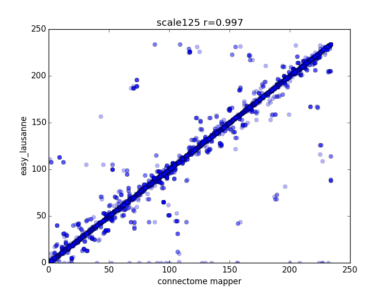
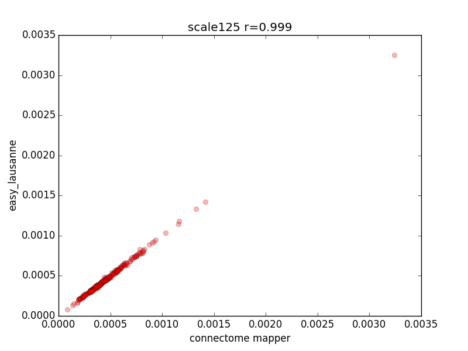
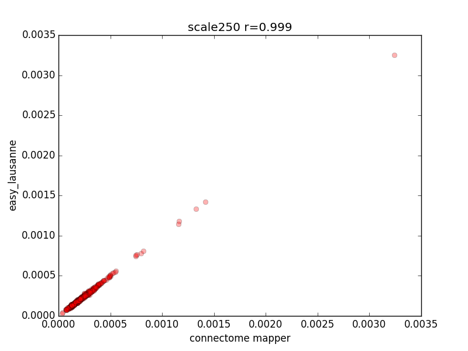

=================
Easy Lausanne
=================

This is an extremely stripped-down version of the connectome mapper,
all it does is create the Lausanne2008 parcellations from an 
existing FreeSurfer directory and align them to a target volume (BOLD or B0)
using bbregister. 

*update 7/10/15* you can use the --run_500 option to generate scale500 along with the other scales

Prerequisites:
---------------
 * FreeSurfer
 * FSL
 * numpy/scipy/nibabel/networkx

*All the hard work was done by the LTS5 folks and they 
should be credited if you use these atlases in your work.*

> A. Daducci, S. Gerhard, A. Griffa, A. Lemkaddem, L. Cammoun, X. Gigandet, 
> R. Meuli, P. Hagmann and J.-P. Thiran The Connectome Mapper: An Open-Source 
> Processing Pipeline to Map Connectomes with MRI. Plos One 7(12):e48121 (2012)

Installation
--------------

```bash
$ git clone https://github.com/mattcieslak/easy_lausanne.git
$ cd easy_lausanne
$ python setup.py install
```
This installs the ``easy_lausanne`` and ``atlas_dilate`` executables on your path. 

Example use
--------------

Assuming FreeSurfer is installed, you've run the Freesurfer setup script,
and recon-all has completely finished for "SUBJECT",
you use easy_lausanne to create the Lausanne2008 atlases aligned to 
VOLUME.nii.gz for "SUBJECT"

```bash
$ easy_lausanne \
     --subject_id SUBJECT \
     --target_volume /path/to/VOLUME.nii.gz \
     --target_type diffusion OR bold \
     --output_dir /where/you/want/results
```

This python package also includes a utility for dilating these cortical
regions. You can use ``atlas_dilate`` like so.

```bash
$ atlas_dilate input_atlas.nii.gz thickened_by_1_voxel.nii.gz
```

Here is the original ROIv_scale33 from a subject



And here is the dilated version



``atlas_dilate`` works by finding all non-labeled voxels that neighbor at
least one labeled voxel.  It extracts the labels from all neighboring voxels
and fills the originally-zero voxel with the statistical mode of its neighbors.
No labeled voxel is ever overwritten with a new value.

Notes
======

If registering to a BOLD image, the --target_type argument should be "bold".  If
it's a B0 volume from a DWI, then use "diffusion".  If there is poor alignment between
the FreeSurfer surfaces and the B0 volume, you can export the native space GFA/QA/FA
image and specify --target_type anisotropy.

Proof of usability
===================

I ran a DSI dataset through the connectomemapper and resampled the Lausanne2008
labels into native B0 space.  ``easy_lausanne`` was then used on a clean copy of
this data to generate the atlases directly in B0 space.  Here are plots of 
the overlap in voxels and the relative sizes of each region for the cmp-generated
and easy_lausanne-generated atlases.

Voxelwise labeling analysis (blue)
---------------------------------
Here each non-zero voxel was compared between the two atlases. The label value
in each voxel is plotted.

Region size comparison (red)
-------------------------------
The proportion of nonzero voxels for each region label is plotted for both versions 
of the Lausanne2008 atlas.

Plots
--------













Credits
========
This source code was sponsored by the U.S. Army Research Office and the 
content of the information does not necessarily reflect the position or
the policy of the government, and no official endorsement should be inferred.

Authors
-------

 * Matt Cieslak
 * Scott Grafton
